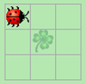
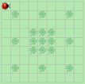
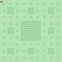
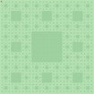

= Übungsblatt zur Rekursion - Softwareentwicklung I
Prof. Dr. Ullrich Hafner <ullrich.hafner@hm.edu>
:icons: font
:toc-title: Inhaltsverzeichnis
:chapter-label:
:chapter-refsig: Kapitel
:section-label: Abschnitt
:section-refsig: Abschnitt

:xrefstyle: short
:!sectnums:
:partnums:
ifndef::includedir[:includedir: ./]
ifndef::imagesdir[:imagesdir: ./]
ifndef::plantUMLDir[:plantUMLDir: .plantuml/]
:figure-caption: Abbildung
:table-caption: Tabelle

ifdef::env-github[]
:tip-caption: :bulb:
:note-caption: :information_source:
:important-caption: :heavy_exclamation_mark:
:caution-caption: :fire:
:warning-caption: :warning:
endif::[]
:stem: latex-math

[TIP]
====

Dieses Übungsblatt (uns das Thema Rekusion) ist nicht prüfungsrelevant und nur als Ansporn für Studierende mit bestehenden Programmierkenntnissen gedacht. Mögliche Abgabe bis zum 27.11. 23:00. Laden Sie Ihre Lösung im https://classroom.github.com/a/X7FW0Y9t[GitHub Classroom Kara Recursion] Projekt auf den eigenen `main` Branch hoch. Im Praktikum zeigen wir Ihnen, wie Sie dies am einfachsten umsetzen.

====

[hinweise]
== Allgemeine Hinweise bzw. Tipps

[TIP]
====

Beachten Sie wieder, dass in allen Aufgaben beliebige Welten (gemäß der Aufgabenstellung) zulässig sind. D.h. eine Aufgabe ist nur teilweise gelöst, wenn Ihr Programm nur für einige der abgebildeten Varianten funktioniert.

Bisher war die Verwendung von komplexeren Java Konstrukten (die noch in späteren Vorlesungen vorgestellt werden) nicht verboten. Dies wird für diese Aufgaben etwas modifiziert: Instanzvariablen, Arrays oder anderweitige Container sind in diesem Blatt **nicht erlaubt**. Nur lokale Variablen (und ggf. Methodenparameter) sind zur Speicherung von Werten erlaubt. Im Zweifelsfall fragen Sie bitte bei mir oder den Tutoren nach, ob Ihre Lösungsvariante erlaubt ist.

Und noch ein letzter Tipp: in vielen Aufgaben benötigen Sie die Breite oder Höhe der Welt als Zahl. Diese können Sie selbst algorithmisch mit den in der Vorlesung vorgestellten Sprachmitteln ermitteln.

====

== X17. Sierpinski Teppich

Malen Sie mit Kara den nach der folgenden rekursiven Formel definierten Sierpinski Teppich (siehe https://de.wikipedia.org/wiki/Sierpinski-Teppich) in einer leeren quadratischen Welt der Breite und Höhe 3^s (s ist eine natürliche Zahl > 0). Kara steht wie immer am Anfang in der linken oberen Ecke mit Blick nach rechts.

Ist s = 1 und damit die Größe des Quadrats 3 x 3, dann fülle das Feld in der Mitte (siehe 1. Bild) mit einem Blatt, alle anderen 8 Felder bleiben leer. Ist s > 1, dann teile das Quadrat in 9 gleiche Quadrate, das mittlere Quadrat wird dabei komplett mit Blättern gefüllt. Jedes der verbleibenden 8 Quadrate wird wieder nach demselben Schema weiter unterteilt.

.Verschiedene Größen für den Sierpinski Teppich (3x3,9x9, 27x27, 81x81)

